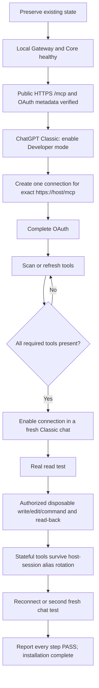

# ChatGPT Classic MCP installation graph

## Core target

DevSpace Ultra is for **ChatGPT Classic on Windows**, not Codex. Codex may install or repair it, but acceptance must happen inside ChatGPT Classic.

It gives ChatGPT Classic local file, patch, command and process tools plus long-task checkpoint/handoff continuity. This does not increase or bypass OpenAI context, token, account usage or rate limits; it is not literal “unlimited tokens.”

## Required graph

If A–C already pass, start immediately at D. Do not reopen the router, reinstall Caddy or redo DNS. Do not do optional Multi-Main, Goal/Rescue or extra plugin work before D–L.

## Multi-computer isolation

Repeat the graph independently for every computer. One ChatGPT Classic account may keep several DevSpace connections, but each row must use that computer's own public `/mcp` URL, `serverInstanceId`, OAuth audience and Connector/App identity. A PASS from another same-named DevSpace connection is never evidence for this machine.

After OAuth, this installation's public MCP resource and `serverInstanceId` identify the computer. Ordinary workspace and Blender tools use that authenticated resource plus an explicit workspace ID or Blender runtime ID; they must not wait for a separate progress-card claim. Goal, Plan and narration are conversation-owned and still require the exact local Classic page. A verified provider-conversation binding can be reused after a fresh check of that page across transport and provider-alias rotation; a fixed timer must not make an active Agent periodically lose work tools.

If `devspace_progress_report` returns a pending claim, its hidden page-local relay completes the claim automatically. The Agent may continue unrelated safe workspace work, but must verify the card before claiming the report succeeded. A separate `devspace_progress_bind` tool is not required; older ChatGPT snapshots may not expose it. Duplicate pages, another conversation reusing the same host session, another computer/resource or missing exact-page proof must still be rejected for conversation-owned state. Never try another computer's connection as a fallback.

## Required tool check

The authenticated ChatGPT Classic connection must show:

`read`, `write`, `edit`, `apply_patch`, `exec_command`, `write_stdin`, `devspace_progress_report`

A callback page, `tools/list`, read-only subset or working Codex connection is not complete acceptance.

OAuth may appear while creating/scanning the connection or on first protected-tool use. Complete it without copying passwords, MFA values, authorization codes, tokens or cookies into chat.

## Final report

Return one PASS/FAIL row for every graph node, the exact MCP URL, connection name, required tools observed, and read/write/reconnect evidence. Any missing row means incomplete.

Official OpenAI flow references:

- [Connect and test your plugin](https://developers.openai.com/plugins/deploy/connect-chatgpt)
- [MCP authentication](https://developers.openai.com/plugins/build/auth)
- [MCP server quickstart](https://developers.openai.com/plugins/build/app-quickstart)
